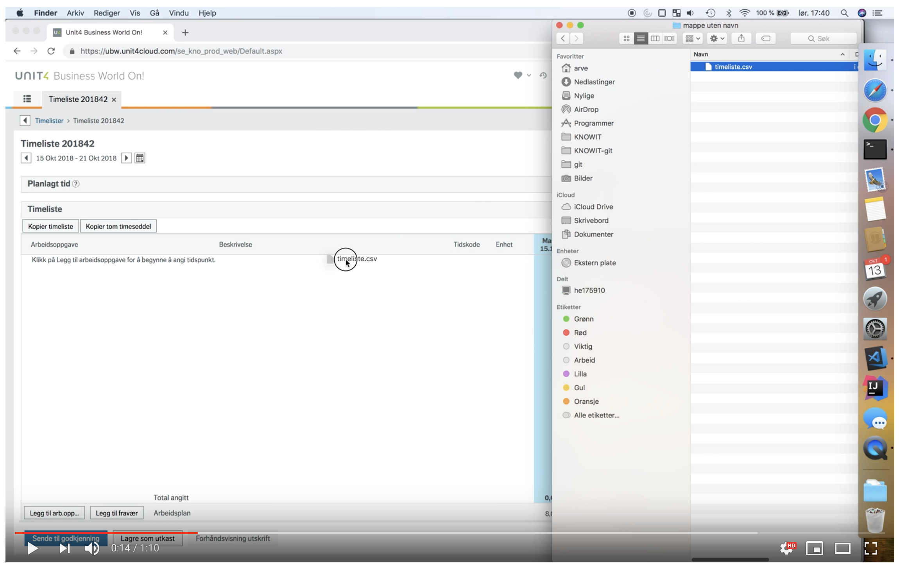
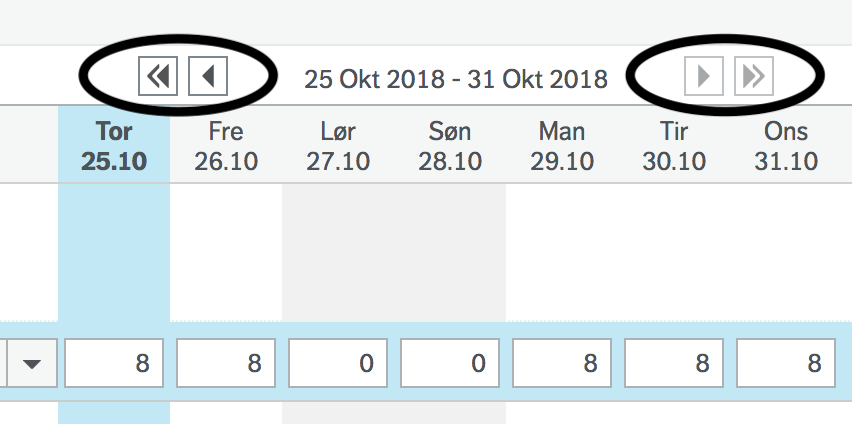

# Unngå UBW

Importer timeliste til UBW fra tekstfil med [komma-](https://en.wikipedia.org/wiki/Comma-separated_values) eller [tab-separerte verdier](https://en.wikipedia.org/wiki/Tab-separated_values).




## Installere

### Firefox
1. [Gå til releases](https://github.com/arve0/uubw/releases).
2. Trykk på `.xpi`-filen.
3. Godta installasjon og gi tilgang til `https://ubw.unit4cloud.com/*`.

### Chrome
1. Klon uubw: `git clone https://github.com/arve0/uubw`
2. Gå til chrome://extensions/.
3. Slå på utviklermodus.
4. Trykk på *Last inn upakket*.
5. Velg mappen til uubw.


## Bruk
### Toggl (CSV-format)
1. Bruk timeren på toggl.com.
2. Tagg timeføringene med `timekode:nr`. `nr` er arbeidsordre i UBW, eksempelvis er administrasjon `32010000-1`.
3. Hvis timeføringen også skal ha en aktivitet, tagg med `aktivitet:nr`.
4. Gå til *Reports* → *Detailed* → Velg tidsperiode, eksempelvis *This Week*.
5. Last ned med knappen oppe til høyre, velg *Download CSV*.
6. Åpne timeføringen i UBW.
7. Dra over CSV-filen til UBW.
8. Drikk kaffe og profiiiiiiit.

### Tabseparerte verdier
1. Lag timeliste i [TSV](https://en.wikipedia.org/wiki/Tab-separated_values) eller et regneark.

	```tsv
	;Arbeidsordre	Aktivitet	Beskrivelse     	man	tir	ons	tor	fre	lør	søn
	32010000-1  	-       	Føre timer i UBW	100
	32010000-1  	-       	Drikke kaffe    	  	8
	32010000-1  	-       	Profiiiiiit     	  		8
	ABSENCE     	-       	Lunsj for de med	0,5	0,5	0,5	0,5	0,5
	ABSENCE     	-       	Lunsjpenger     	1 	1 	1 	1 	1
	```

2. Åpne timeføringen i UBW.
3. Dra over TSV-filen til UBW.
4. Drikk kaffe og profiiiiiiit.


## Fravær
Bruk arbeidsordre `ABSENCE` for å legge inn fravær. Beskrivelsen brukes til å
velge riktig type fravær. Beskrivelsen må være _identisk_ lik den du finner i UBW.


## Filformat
### CSV
Første linje brukes for å velge kolonner. Felt i bruk er `Description`, `Start date`, `Duration` og `Tags`.

Eksempeleksport fra toggl:
```csv
User,Email,Client,Project,Task,Description,Billable,Start date,Start time,End date,End time,Duration,Tags,Amount (USD)
Ditt Navn,din@epost.no,,,,beskrivelse1,No,2019-04-01,08:00:00,2019-04-01,08:15:00,00:15:00,"timekode:32010000-1",
Ditt Navn,din@epost.no,,,,beskrivelse2,No,2019-04-01,08:15:00,2019-04-01,08:30:00,00:15:00,"timekode:32010000-3",
```

Hvis en ønsker lage CSV selv, vil CSV være:
```csv
Description,Start date,Duration,Tags
beskrivelse1,2019-04-01,00:15:00,"timekode:32010000-1"
beskrivelse2,2019-04-01,00:15:00,"timekode:32010000-3"
```

### TSV
- Linjer som starter med `;` blir ignorert.
- Verdiene er separert med tab.
- La arbeidsordre som ikke har aktivitet være tom, eller bruk `-`.
- Timene blir fylt en kolonne av gangen. Det vil si at første kolonne vanligvis
  er mandag, så kommer tirsdag, osv.
- Mellomrom før og etter verdier blir fjernet.

#### Korte og lange uker
Noen uker er ekstra lange. Eksempelvis uke 43 i 2018, som er fra 22. oktober til 31. oktober.
For lange uker trengs ekstra kolonner for å føre timene:

```tsv
;arbordre	aktivitet	beskrivelse	man	tir	ons	tor	fre	lør	søn	man	tir	ons
32010000-1	-       	Lese epost	8	8	8	8	8			8	8	8
```

Når timene føres vil de ikke bli synlig. En må navigere seg i kalenderen
for å kontrollere timene for alle dagene:



Tilsvarende blir det for kort uke, bare med færre kolonner i TSV-filen. Om en fører i
for mange kolonner, vil UBW vise summen, men når en lagrer valideres og korrigeres
timelisten.


## Utvikler
Kjør `npm start`, så åpner Firefox med automatisk reload av plugin. Dog, du må oppdatere
UBW for at content-scriptet skal bli lastet inn på nytt ved endringer.


## Lisens
Copyright Arve Seljebu
